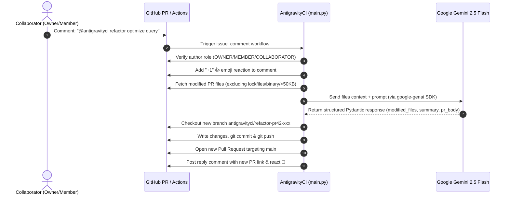

# AntigravityCI 🚀

[](https://github.com/features/actions)
[](https://ai.google.dev/)
[](https://www.python.org/downloads/)
[](LICENSE)

**AntigravityCI** is an open-source, AI-powered GitHub Action that acts as an intelligent PR assistant directly inside your Pull Request comments. Powered by **Google Gemini 2.5 Flash** and the official `google-genai` SDK, it understands your repository's context, refactors code, fixes bugs, adds unit tests, and opens clean follow-up Pull Requests on demand.

---

## 🎬 Demo

```text
PR Comment:
  @antigravityci refactor optimize this async loop and eliminate redundant DB calls

AntigravityCI:
  👍 Reacts with +1 to acknowledge receipt
  💬 Replies immediately with instruction replay acknowledging the refactoring request
  🧠 Analyzes modified PR files and diff context with Gemini 2.5 Flash
  🌿 Creates branch: antigravityci/refactor-pr42-a8f9
  📝 Commits code & pushes to origin
  🚀 Opens Pull Request #43 targeting `main`
  💬 Comments PR link with full change summary on original PR
```

> _[Demo GIF Placeholder: Replace with `docs/assets/demo.gif`]_

---

## ✨ Features

- **💬 Comment-Driven Trigger**: Mention `@antigravityci <command> <instruction>` on any PR comment to trigger the assistant.
- **⚡ Instant Feedback**: Automatically acknowledges requests with a 👍 emoji reaction on the trigger comment and a 🚀 reaction upon completion.
- **🧠 Google Gemini 2.5 Flash**: Utilizes the official `google-genai` Python SDK with structured Pydantic response schemas for deterministic, parseable, and high-fidelity code modifications.
- **🛡️ Built-in Security Authorization**: Enforces strict role checks—only repository `OWNER`, `MEMBER`, and `COLLABORATOR` roles can trigger workflows, preventing unauthorized usage or prompt injection.
- **🔒 Safety File Filters**: Automatically ignores lockfiles (`package-lock.json`, `pnpm-lock.yaml`, `poetry.lock`, `Cargo.lock`, etc.), binary assets (images, fonts, archives), and oversized files (>50KB).
- **🌿 Dedicated Branch & PR Creation**: Keeps your commit history clean by generating dedicated branches (`antigravityci/<command>-pr<number>-<short-id>`) and opening a linked PR targeting your base branch.

---

## 🚀 Quick Start

### 1. Get a Google Gemini API Key
Obtain an API key from [Google AI Studio](https://aistudio.google.com/).

### 2. Add Secrets to your GitHub Repository
Go to **Settings > Secrets and variables > Actions** and add:
- `GEMINI_API_KEY`: Your Google Gemini API Key.

### 3. Create the Workflow File
Add `.github/workflows/antigravityci.yml` to your repository:

```yaml
name: AntigravityCI PR Assistant

on:
  issue_comment:
    types: [created]

jobs:
  antigravityci:
    name: Run AntigravityCI
    # Ensure this only runs on Pull Request comments
    if: ${{ github.event.issue.pull_request }}
    runs-on: ubuntu-latest
    permissions:
      contents: write       # Push branch and commit code
      pull-requests: write  # Open new PR and post comments
      issues: write         # React with emojis and comment on threads
    steps:
      - name: Checkout Code
        uses: actions/checkout@v4
        with:
          fetch-depth: 0

      - name: Run AntigravityCI
        uses: your-org/antigravityci@v1
        with:
          gemini_api_key: ${{ secrets.GEMINI_API_KEY }}
          github_token: ${{ secrets.GITHUB_TOKEN }}
          model: "gemini-2.5-flash"
          bot_name: "@antigravityci"
```

---

## 💡 Example Commands

You can tag AntigravityCI in any PR comment with any custom command and instruction:

| Command | Example Usage | What AntigravityCI Does |
|---|---|---|
| `refactor` | `@antigravityci refactor optimize this async query loop` | Refactors code for performance and readability |
| `fix` | `@antigravityci fix handle edge case when token is expired` | Resolves bugs and implements edge-case guards |
| `test` | `@antigravityci test add pytest test cases for auth module` | Generates comprehensive test suites |
| `review` | `@antigravityci review check for potential memory leaks` | Analyzes code and suggests hardened solutions |
| `doc` | `@antigravityci doc add Google-style docstrings to public API` | Adds clean documentation and type annotations |

---

## ⚙️ Configuration Options

| Input | Description | Required | Default |
|---|---|:---:|:---:|
| `gemini_api_key` | Google Gemini API Key | **Yes** | — |
| `github_token` | GitHub token for git & API operations | No | `${{ github.token }}` |
| `model` | Gemini model name (e.g. `gemini-2.5-flash`, `gemini-2.5-pro`) | No | `gemini-2.5-flash` |
| `bot_name` | Comment trigger handle | No | `@antigravityci` |
| `max_file_size_kb` | Max individual file size in KB sent to LLM context | No | `50` |
| `target_branch` | Target branch for generated PR (`auto` uses base of PR) | No | `auto` |

---

## 🏗️ Architecture Flow



---

## 🛡️ Security & Safety Model

1. **Role Enforcement**:
   - Only users with `author_association` of `OWNER`, `MEMBER`, or `COLLABORATOR` can invoke AntigravityCI. Comments from unauthorized users (`CONTRIBUTOR`, `FIRST_TIME_CONTRIBUTOR`, `NONE`) are safely ignored.
2. **Context Safety**:
   - Lockfiles (`package-lock.json`, `pnpm-lock.yaml`, `yarn.lock`, `Cargo.lock`, `poetry.lock`, etc.) are filtered out to prevent token waste and context bloat.
   - Binary files and oversized files (>50KB by default) are omitted.
3. **Branch Isolation**:
   - AntigravityCI never pushes directly to existing PR branches or protected branches. It always creates a fresh, isolated branch and opens a new Pull Request for human review.

---

## 🧪 Local Development & Testing

1. Clone the repository:
   ```bash
   git clone https://github.com/your-org/antigravityci.git
   cd antigravityci
   ```

2. Install dependencies:
   ```bash
   python -m venv .venv
   source .venv/bin/activate
   pip install -r requirements.txt
   pip install pytest pytest-mock ruff
   ```

3. Run test suite:
   ```bash
   pytest tests/ -v
   ```

4. Run linter:
   ```bash
   ruff check .
   ```

---

## 📄 License

Distributed under the MIT License. See [LICENSE](LICENSE) for details.
