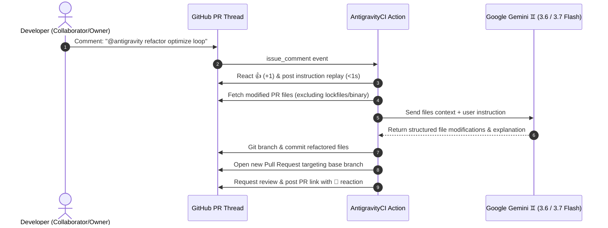

### 🌌 AntigravityCI

### Autonomous AI PR Assistant · Powered by Google Gemini ♊

[](https://ai.google.dev/)
[](https://github.com/features/actions)
[](LICENSE)

**AntigravityCI** is an autonomous AI pair-programming assistant that lives directly inside your GitHub Pull Requests.

Simply tag `@antigravity refactor`, `fix`, `test`, or `doc` in any PR comment. AntigravityCI will instantly acknowledge receipt (<1.5s), analyze code diffs with Google Gemini, commit hardened improvements to an isolated branch, and open a ready-to-merge Pull Request.

<br clear="right" />

---

## 🎬 How It Works


<br>

```text
1. Developer comments on a PR:
   @antigravity refactor optimize this async query loop and eliminate redundant DB calls

2. AntigravityCI reacts instantly:
   👍 Reacts +1 to comment in <1.5s
   💬 Replies immediately with instruction replay

3. AntigravityCI executes in the background:
   🧠 Analyzes PR file diffs with Google Gemini (3.6 / 3.7 Flash)
   🌿 Creates dedicated branch: antigravityci/refactor-pr42-a8f9
   📝 Commits refactored code & pushes to origin
   🚀 Opens new Pull Request #43 targeting the base branch
   💬 Posts PR link and change summary to the original thread
```

---

## ✨ Features

- **♊ Google Gemini Powered**: Native integration with Google Gemini 3.6 & 3.7 Flash models with automated multi-model cascade fallbacks for 100% uptime.
- **⚡ 2-Second Execution**: Ultra-fast response times running on Google's high-speed cloud TPUs.
- **💬 Multi-Handle Support**: Supports `@antigravity`, `@AntiGravity`, `@antigravityci`, and `@AntigravityCI` commands.
- **⚡ 2-Job Concurrent Architecture**: Instant acknowledgment (<1.5s) decoupled from the AI code generation pipeline.
- **🛡️ Built-in Security Authorization**: Enforces strict repository permission checks—only authorized collaborators (`OWNER`, `MEMBER`, `COLLABORATOR`) can trigger runs.
- **🚫 Safe Context Filters**: Automatically filters out lockfiles (`package-lock.json`, `poetry.lock`, `Cargo.lock`, etc.), binary assets, and oversized files (>50KB).
- **🌿 Clean Branch Isolation**: Never modifies existing PR branches or commits directly to `main`—always creates a clean, isolated branch and PR for human review.

---

## 🚀 Quick Start (1-Minute Setup)

### 1. Get a Free Google Gemini API Key

Obtain a free API key from [Google AI Studio](https://aistudio.google.com/).

### 2. Add Secrets to your GitHub Repository

Go to **Settings > Secrets and variables > Actions** and add:

- `GEMINI_API_KEY`: Your Google Gemini API Key.

### 3. Enable Workflow Permissions (Important ⚠️)

To allow AntigravityCI to push refactored code and open Pull Requests:

1. Go to **Settings > Actions > General**.
2. Under **Workflow permissions**:
   - Select **Read and write permissions**.
   - Check **Allow GitHub Actions to create and approve pull requests**.
3. Click **Save**.

### 4. Create the Workflow File

Create `.github/workflows/antigravityci.yml` in your repository and paste the following:

```yaml
# Make Sure to set the GEMINI_API_KEY secret in your repository settings for this workflow to function correctly.
name: AntigravityCI

on:
  issue_comment:
    types: [created]

jobs:
  antigravity:
    name: AntigravityCI PR Assistant
    if: ${{ github.event.issue.pull_request && !endsWith(github.actor, '[bot]') && (contains(github.event.comment.body, 'antigravity') || contains(github.event.comment.body, 'AntiGravity') || contains(github.event.comment.body, 'Antigravity')) }}
    runs-on: ubuntu-latest
    permissions:
      contents: write
      pull-requests: write
      issues: write
    steps:
      - name: Checkout Repository
        uses: actions/checkout@v4
        with:
          fetch-depth: 0

      - name: Run AntigravityCI
        uses: nivinvysakh/AntigravityCi@main
        with:
          github_token: ${{ secrets.GITHUB_TOKEN }}
          gemini_api_key: ${{ secrets.GEMINI_API_KEY }}
```

---

## 💡 Commands & Features

Tag AntigravityCI in any Pull Request discussion with any natural instruction or optional inline flags:

| Command | Example Usage | What AntigravityCI Does |
|---|---|---|
| `fix-ci` *(or `fixci`)* | `@antigravity fix-ci` | **Self-healing CI**: Reads failed GitHub Actions logs & opens a patch PR fixing broken tests |
| `polish-pr` *(or `polish`)* | `@antigravity polish-pr enhance title and summary` | **PR Enhancer**: Rewrites PR title to conventional commits & formats rich structured description |
| `review` | `@antigravity review check for memory leaks` | **Inline Review**: Posts line-by-line review comments with **one-click GitHub commit suggestions** |
| `explain` | `@antigravity explain breakdown architectural tradeoffs` | **Architecture Breakdown**: Posts an ELI5 walkthrough with **auto-generated Mermaid diagrams** |
| `security` *(or `audit`)* | `@antigravity security audit for OWASP Top 10 vulnerabilities` | Audits modified files for injection, leaks, and security flaws, creating a hardened patch PR |
| `perf` *(or `optimize`)* | `@antigravity perf eliminate redundant allocations and async lag` | Performance-focused profiling and optimization |
| `types` | `@antigravity types add strict TypeScript interfaces / type hints` | Adds strict type definitions, annotations, and schemas |
| `changelog` *(or `summarize`)* | `@antigravity changelog generate user-facing release notes` | Generates Conventional Changelog release notes |
| `refactor` | `@antigravity refactor optimize this async query loop` | Refactors code for performance, readability, and idiomatic style |
| `fix` | `@antigravity fix handle edge case when token is expired` | Identifies bugs, resolves exceptions, and adds edge-case guards |
| `test` | `@antigravity test add pytest / vitest test cases for auth` | Generates comprehensive unit and integration test suites |
| `doc` | `@antigravity doc add Google-style docstrings with examples` | Adds clean type annotations, docstrings, and documentation |

### 🎛️ Inline Command Flags

Customize AI behavior directly in your PR comments:

```text
@antigravity perf optimize db queries --model=gemini-3.7-flash --deep
```

- `--model=<name>`: Override default Gemini model (e.g. `gemini-3.7-flash`, `gemini-3.6-flash`)
- `--deep`: Instructs the model to perform deeper multi-step architectural reasoning

---

## ⚙️ Custom Team Rules (`.antigravity.json`)

You can optionally add a `.antigravity.json` file in your repository root to enforce team conventions:

```json
{
  "rules": [
    "Always use TypeScript strict mode with explicit return types",
    "Prefer immutable data structures and functional programming patterns",
    "Use Vitest for unit testing with comprehensive edge cases"
  ]
}
```

---

## 📊 AI Risk & Quality Scorecard

Every generated Pull Request includes an automated risk evaluation:

- 🛡️ **Risk Level**: `🟢 Low` / `🟡 Medium` / `🔴 High`
- ⚠️ **Breaking Changes**: `✅ None` / `⚠️ Yes`
- 📁 **Files Changed**: Accurate file modification count

---

## ⚙️ Action Inputs

| Input | Description | Required | Default |
|---|---|:---:|:---:|
| `gemini_api_key` | Google Gemini API Key from Google AI Studio | **Yes** | — |
| `github_token` | GitHub Token for API operations (`secrets.GITHUB_TOKEN`) | No | `${{ github.token }}` |
| `model` | Gemini model name (`gemini-3.6-flash`, `gemini-3.7-flash`) | No | `"gemini-3.6-flash"` |
| `bot_name` | Comment trigger handle | No | `"@antigravityci"` |
| `post_ack` | Whether to post instruction replay in thread | No | `"true"` |
| `max_file_size_kb` | Max individual file size in KB sent to LLM context | No | `50` |
| `target_branch` | Target branch for generated PR (`auto` uses base of PR) | No | `"auto"` |

---

## 🏗️ Architecture Flow



---

## 🛡️ Security & Safety Model

1. **Role Enforcement**:
   - Only users with `author_association` of `OWNER`, `MEMBER`, or `COLLABORATOR` can invoke AntigravityCI. Comments from unauthorized users are safely ignored.
2. **Context Safety**:
   - Lockfiles (`package-lock.json`, `pnpm-lock.yaml`, `yarn.lock`, `Cargo.lock`, `poetry.lock`, etc.) are filtered out to prevent context bloat.
   - Binary assets and oversized files (>50KB) are skipped automatically.
3. **Branch Isolation**:
   - AntigravityCI never pushes directly to existing PR branches or protected branches. It always creates a fresh, isolated branch and opens a new Pull Request for human review.

---

## 🧪 Local Development

1. Clone the repository:

   ```bash
   git clone https://github.com/nivinvysakh/AntigravityCi.git
   cd AntigravityCi
   ```

2. Install dependencies:

   ```bash
   npm install
   ```

3. Run automated tests and build:

   ```bash
   npm test
   npm run build
   ```

---

## ⚖️ Disclaimer

**AntigravityCI** is an independent open-source community project and is not officially affiliated with, endorsed by, sponsored by, or associated with Google LLC, Alphabet Inc., or the Google Gemini project.

*Google*, *Google Gemini*, and related marks, logos, and brands are trademarks or registered trademarks of Google LLC. All other product names, logos, and brands mentioned are property of their respective owners.

---

## 📄 License

Distributed under the MIT License. See [LICENSE](LICENSE) for details.
