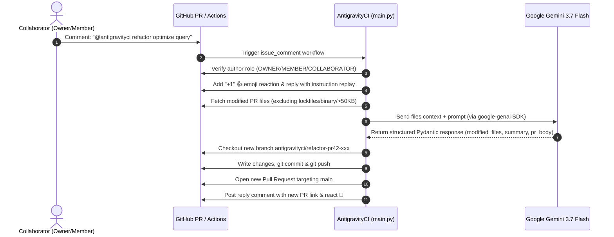

[](https://github.com/features/actions)
[](https://huggingface.co/Qwen/Qwen2.5-Coder-1.5B-Instruct-GGUF)
[](https://ai.google.dev/)
[](LICENSE)

**AntigravityCI** is an open-source, AI-powered GitHub Action that acts as an intelligent PR assistant directly inside your Pull Request comments. 

It runs as a **self-contained Docker Action** with an **embedded local Qwen2.5-Coder-1.5B LLM** powered by `llama.cpp` — requiring **zero API keys and zero configuration**. It also supports optional cloud fallbacks to **Google Gemini** (with automatic multi-model cascade).

---

## 🎬 Demo

```text
PR Comment:
  @antigravityci refactor optimize this async loop and eliminate redundant DB calls

AntigravityCI:
  👍 Reacts with +1 to acknowledge receipt
  💬 Replies immediately with instruction replay
  🧠 Generates code improvements (via Local Qwen2.5-Coder or Cloud Gemini)
  🌿 Creates branch: antigravityci/refactor-pr42-a8f9
  📝 Commits code & pushes to origin
  🚀 Opens Pull Request #43 targeting `main`
  💬 Comments PR link with full change summary on original PR
```

> _[Demo GIF Placeholder: Replace with `docs/assets/demo.gif`]_

---

## ✨ Features

- **🔒 100% Offline & Free by Default**: Embedded local `Qwen2.5-Coder-1.5B` GGUF engine running on CPU via `llama.cpp`. Zero API keys, zero 503 rate limits.
- **⚡ Cloud Cascade (Optional)**: If you provide a `GEMINI_API_KEY`, it uses Gemini with an automatic multi-model fallback cascade (`gemini-2.5-flash` $\rightarrow$ `gemini-2.0-flash` $\rightarrow$ `gemini-1.5-flash` $\rightarrow$ local fallback) to eliminate downtime.
- **💬 Comment-Driven Trigger**: Mention `@antigravityci <command> <instruction>` on any PR comment to trigger.
- **⚡ Instant Feedback**: Reacts with 👍 and replies with an immediate instruction replay comment, followed by a 🚀 reaction on completion.
- **🛡️ Built-in Security Authorization**: Enforces strict role checks—only repository `OWNER`, `MEMBER`, and `COLLABORATOR` roles can trigger workflows.
- **🔒 Safety File Filters**: Automatically ignores lockfiles (`package-lock.json`, `poetry.lock`, `Cargo.lock`, etc.), binary assets, and oversized files (>50KB).
- **🌿 Dedicated Branch & PR Creation**: Generates dedicated branches (`antigravityci/<command>-pr<number>-<short-id>`) and opens clean Pull Requests for human review.

---

## 🚀 Quick Start

### 1. Get a Google Gemini API Key
Obtain an API key from [Google AI Studio](https://aistudio.google.com/).

### 2. Add Secrets to your GitHub Repository
Go to **Settings > Secrets and variables > Actions** and add:
- `GEMINI_API_KEY`: Your Google Gemini API Key.

### 3. Create the Workflow File
Add `.github/workflows/antigravityci.yml` to your repository:

```yaml
name: AntigravityCI PR Assistant

on:
  issue_comment:
    types: [created]

jobs:
  # ==========================================================================
  # Job 1: Instant Acknowledgment (<2s)
  # Reacts with 👍 (+1) and posts the instruction replay comment immediately.
  # ==========================================================================
  acknowledge:
    name: Instant Acknowledgment
    # Fast skip (0s): Only runs if the comment contains antigravity / AntiGravity
    if: ${{ github.event.issue.pull_request && !endsWith(github.actor, '[bot]') && (contains(github.event.comment.body, 'antigravity') || contains(github.event.comment.body, 'AntiGravity') || contains(github.event.comment.body, 'Antigravity')) }}
    runs-on: ubuntu-latest
    permissions:
      issues: write
      pull-requests: write
    steps:
      - name: Fast React & Replay Comment
        uses: actions/github-script@v7
        with:
          github-token: ${{ secrets.GITHUB_TOKEN }}
          script: |
            const comment = context.payload.comment;
            const issue = context.payload.issue;
            if (!comment || !issue) return;

            // Security: Author role check
            const authorRole = comment.author_association;
            const allowedRoles = ['OWNER', 'MEMBER', 'COLLABORATOR'];
            if (!allowedRoles.includes(authorRole)) {
              console.log(`User role '${authorRole}' is not authorized. Skipping.`);
              return;
            }

            // Case-insensitive regex match for bot tag (@antigravity or @antigravityci)
            const body = comment.body.trim();
            const match = body.match(/@antigravity(?:ci)?\s+([a-zA-Z0-9_-]+)(?:\s+([\s\S]+))?/i);
            if (!match) {
              console.log('Comment does not contain @antigravity / @antigravityci command. Skipping.');
              return;
            }

            const cmd = match[1];
            const instruction = (match[2] || '').trim();
            const author = comment.user.login;

            // 1. React with +1 (thumbs up) immediately
            try {
              await github.rest.reactions.createForIssueComment({
                owner: context.repo.owner,
                repo: context.repo.repo,
                comment_id: comment.id,
                content: '+1'
              });
            } catch (err) {
              console.log('Reaction error:', err.message);
            }

            // 2. Post instant instruction replay comment
            const actionVerb = (cmd.toLowerCase() === 'refactor' || cmd.toLowerCase() === 'refactoring')
              ? 'Refactoring your code'
              : `Processing \`${cmd}\``;
            
            const replay = `@antigravityci ${cmd} ${instruction}`.trim();
            const message = `🤖 **AntigravityCI**: ${actionVerb} for @${author}!\n\n> 💬 **Instruction Replay:** \`${replay}\`\n\n⏳ Spawning AI engine and analyzing PR #${issue.number} modified files. I'll open a new PR shortly...`;

            try {
              await github.rest.issues.createComment({
                owner: context.repo.owner,
                repo: context.repo.repo,
                issue_number: issue.number,
                body: message
              });
            } catch (err) {
              console.log('Comment error:', err.message);
            }

  # ==========================================================================
  # Job 2: Core Processing Engine (Runs concurrently with Job 1)
  # Performs AI analysis, git branching, PR creation, and reviewer assignment.
  # ==========================================================================
  process:
    name: Process AntigravityCI PR Action
    # Fast skip (0s): Only runs if the comment contains antigravity / AntiGravity
    if: ${{ github.event.issue.pull_request && !endsWith(github.actor, '[bot]') && (contains(github.event.comment.body, 'antigravity') || contains(github.event.comment.body, 'AntiGravity') || contains(github.event.comment.body, 'Antigravity')) }}
    runs-on: ubuntu-latest
    permissions:
      contents: write       # Needed to create/delete branches and push commits
      pull-requests: write  # Needed to create PRs, request reviewers, post comments
      issues: write         # Needed to react and comment on PR issue threads
    steps:
      - name: Checkout Repository
        uses: actions/checkout@v4
        with:
          fetch-depth: 0

      - name: Run AntigravityCI Core Engine
        uses: nivinvysakh/AntigravityCi@main
        with:
          github_token: ${{ secrets.GITHUB_TOKEN }}
          gemini_api_key: ${{ secrets.GEMINI_API_KEY }}  # Optional (runs locally on CPU if omitted)
          engine: "auto"
          bot_name: "@antigravityci"
          post_ack: "false"
```

---

## 💡 Example Commands

You can tag AntigravityCI in any PR comment with any custom command and instruction:

| Command | Example Usage | What AntigravityCI Does |
|---|---|---|
| `refactor` | `@antigravityci refactor optimize this async query loop` | Refactors code for performance and readability |
| `fix` | `@antigravityci fix handle edge case when token is expired` | Resolves bugs and implements edge-case guards |
| `test` | `@antigravityci test add pytest test cases for auth module` | Generates comprehensive test suites |
| `review` | `@antigravityci review check for potential memory leaks` | Analyzes code and suggests hardened solutions |
| `doc` | `@antigravityci doc add Google-style docstrings to public API` | Adds clean documentation and type annotations |

---

## ⚙️ Configuration Options

| Input | Description | Required | Default |
|---|---|:---:|:---:|
| `gemini_api_key` | Google Gemini API Key | **Yes** | — |
| `github_token` | GitHub token for git & API operations | No | `${{ github.token }}` |
| `model` | Gemini model name (e.g. `gemini-3.7-flash`, `gemini-2.5-flash`, `gemini-2.5-pro`) | No | `gemini-3.7-flash` |
| `bot_name` | Comment trigger handle | No | `@antigravityci` |
| `max_file_size_kb` | Max individual file size in KB sent to LLM context | No | `50` |
| `target_branch` | Target branch for generated PR (`auto` uses base of PR) | No | `auto` |

---

## 🏗️ Architecture Flow



---

## 🛡️ Security & Safety Model

1. **Role Enforcement**:
   - Only users with `author_association` of `OWNER`, `MEMBER`, or `COLLABORATOR` can invoke AntigravityCI. Comments from unauthorized users (`CONTRIBUTOR`, `FIRST_TIME_CONTRIBUTOR`, `NONE`) are safely ignored.
2. **Context Safety**:
   - Lockfiles (`package-lock.json`, `pnpm-lock.yaml`, `yarn.lock`, `Cargo.lock`, `poetry.lock`, etc.) are filtered out to prevent token waste and context bloat.
   - Binary files and oversized files (>50KB by default) are omitted.
3. **Branch Isolation**:
   - AntigravityCI never pushes directly to existing PR branches or protected branches. It always creates a fresh, isolated branch and opens a new Pull Request for human review.

---

## 🧪 Local Development & Testing

1. Clone the repository:
   ```bash
   git clone https://github.com/your-org/antigravityci.git
   cd antigravityci
   ```

2. Install dependencies:
   ```bash
   python -m venv .venv
   source .venv/bin/activate
   pip install -r requirements.txt
   pip install pytest pytest-mock ruff
   ```

3. Run test suite:
   ```bash
   pytest tests/ -v
   ```

4. Run linter:
   ```bash
   ruff check .
   ```

---

## 📄 License

Distributed under the MIT License. See [LICENSE](LICENSE) for details.
